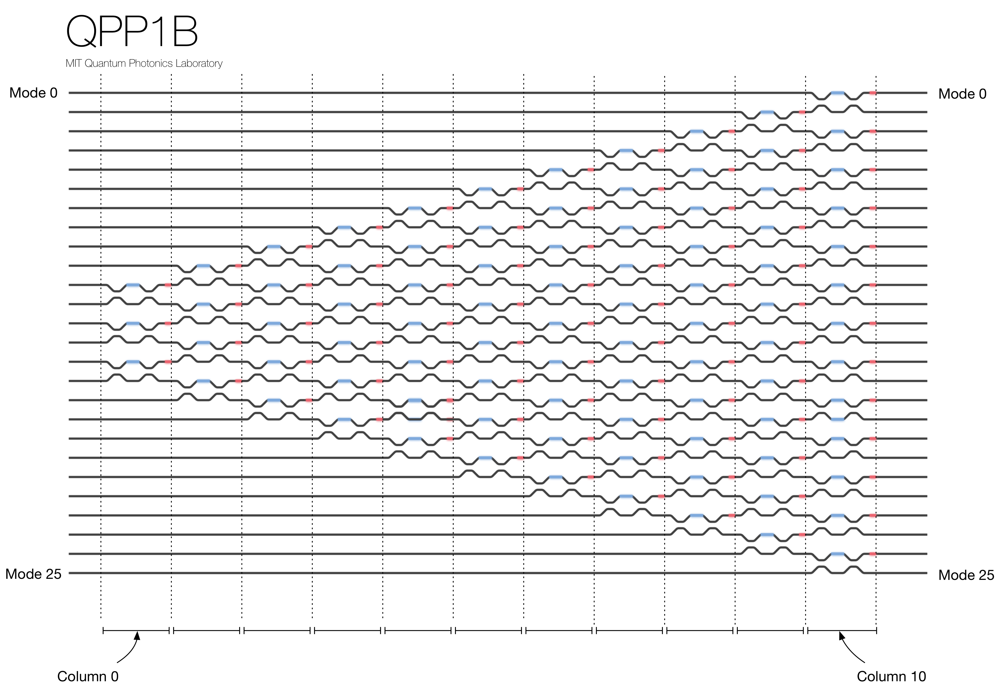

#n_simulate
Welcome to n_simulate. This repository contains compile python code enabling collaborators to develop classical and quantum simulations for the programmable nanophotonic processor (or quantum photonic processor).

